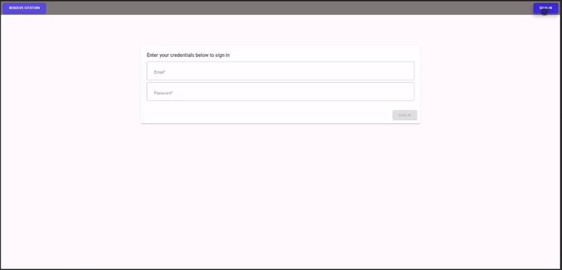
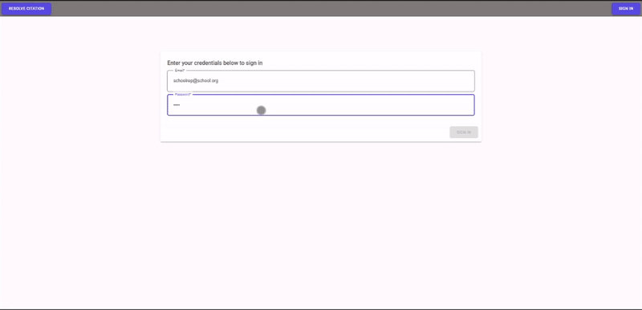
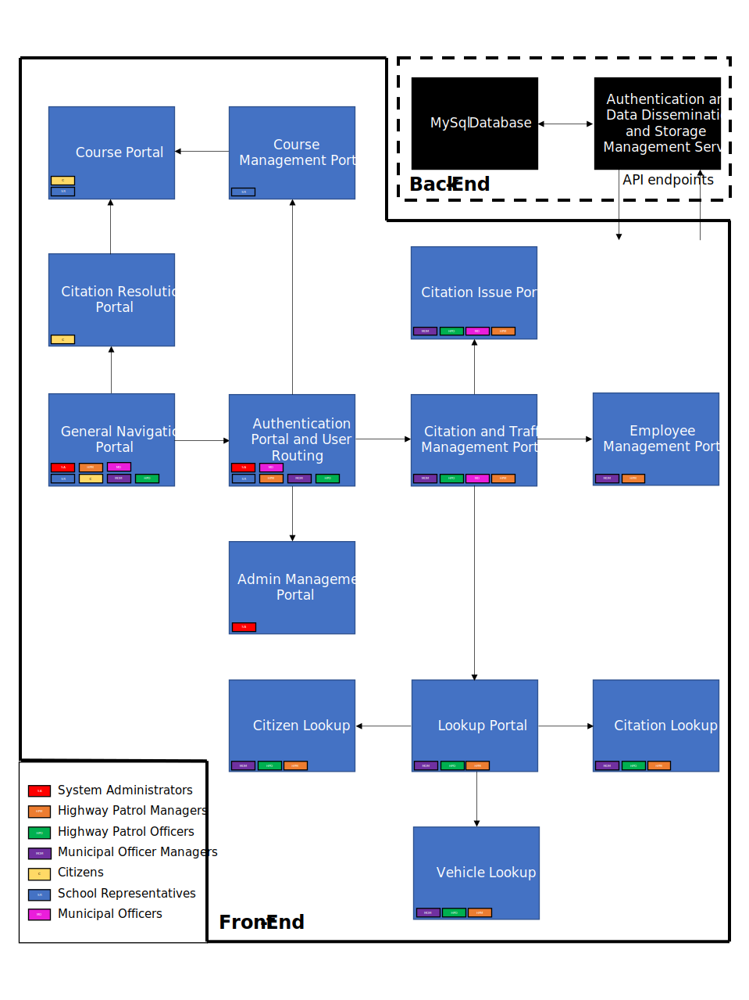
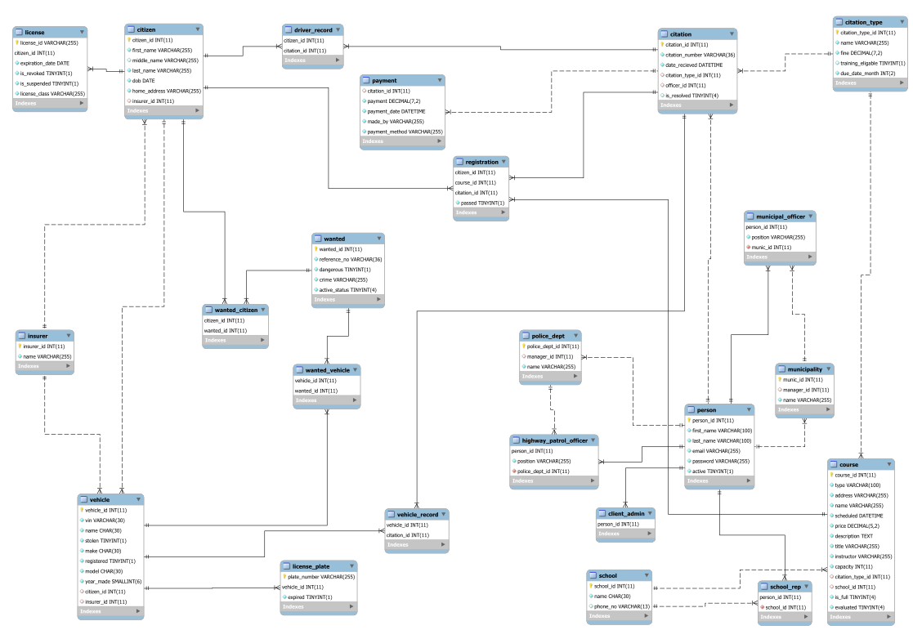

# TCRS

Traffic Citation Resolution System is a fullstack web app built for COSC3506 - Software Engineering written entirely in C#

## Tech stack

- Backend: ASP&#46;NET 5.0
- Client: Blazor WebAssembly (wasm)
- Database: MySQL
- Authentication System: JWT
- Component Library: MudBlazor

## Preview

Officer/Manager Pages

School Rep/Citizen Pages

## Application Structure

## Database Entity Relationship Diagram

